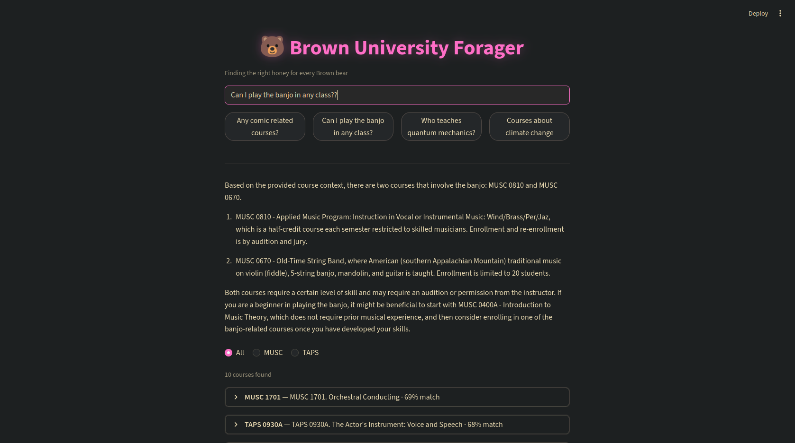

# BrownBot - Brown University Course Advisor

A RAG (Retrieval-Augmented Generation) pipeline that scrapes Brown University course data from CAB and the Bulletin, indexes it in a vector database, and answers natural language questions about courses with cross-disciplinary suggestions that surface connections students wouldn't find browsing by department.

## Why

Course search at Brown is split across two systems. CAB has schedules and instructors. The Bulletin has descriptions and prerequisites. Neither talks to the other, and neither understands what you mean when you type "ML courses on Fridays."

BrownBot merges both sources into a single vector space, layers hybrid search on top, and uses an LLM to generate answers grounded in real course data. The cross-disciplinary suggestion system finds courses from other departments that live near your query in embedding space — a CS student asking about machine learning might discover relevant courses in Applied Math or Public Health that they'd never encounter through traditional browsing.

## Architecture

```
Scrapers (CAB + Bulletin) ──→ Merged JSON ──→ Qdrant Vector DB
                                              E5-base-v2 embeddings
                                              (query:/passage:)
                                                     │
FastAPI (async) ─────────────────────────── Hybrid Search
     │                                              │
     ├─────────────────────────────────── Ollama (Mistral)
     │
Streamlit UI
```

**Components:**
- **Scrapers**: Playwright for CAB, requests/BeautifulSoup for Bulletin, with normalized course codes
- **Search**: Hybrid — semantic retrieval fetches 3x candidates, then rapidfuzz keyword reranking on the candidate set
- **Suggestions**: Cross-departmental "students exploring this also found" recommendations via embedding similarity
- **Frontend**: Streamlit with expandable course cards, department filtering, and suggestion section

## Example Queries

- "Who teaches APMA2680, and when does the class meet?"
- "I am interested in Philosophy courses related to metaphysics. Which ones do you recommend?"
- "Find a Brown Bulletin course similar to CSCI0320 from CAB."
- "List all CAB courses taught on Fridays after 3 pm related to machine learning."
- "What ML courses are available?"



### Full Demo

> Running on an i5-7400, GTX 1060 3GB, and 8GB DDR3 — the LLM generation is slow on this machine, but it works.

https://github.com/user-attachments/assets/7e8f1c31-ca43-40a2-8d00-28e1c04aea21

## Quick Start (Docker)

```bash
# Start all services
docker-compose up --build

# Pull the LLM model (first time only)
docker exec -it brownbot-ollama-1 ollama pull mistral

# Run scraper (from host or inside api container)
docker exec -it brownbot-api-1 python scripts/run_scrape.py

# Ingest into Qdrant
docker exec -it brownbot-api-1 python scripts/run_ingest.py
```

Then visit:
- **Frontend**: http://localhost:8501
- **API docs**: http://localhost:8000/docs
- **Qdrant dashboard**: http://localhost:6333/dashboard

## Design Decisions

- **E5-base-v2 over MiniLM**: MiniLM is symmetric — it embeds queries and documents the same way. This breaks down when a short query ("What ML courses?") needs to match a long course description. E5 uses explicit `query:` and `passage:` prefixes for asymmetric retrieval. In testing, MiniLM mapped "ML" closer to "Mathematics" (cosine 0.51) than "Machine Learning" (0.31) — the top-5 results were all wrong. E5 resolves common abbreviations natively, and the 768-dim space captures finer distinctions than MiniLM's 384.
- **Qdrant over FAISS**: FAISS is fast but stores only vectors and integer IDs. Filtering by department would mean post-filtering (breaks top-k counts) or maintaining separate indexes per filter (combinatorial explosion). Qdrant applies filters during ANN search, carries full course payloads alongside vectors, provides built-in full-text indexing for hybrid search, and runs as a single Docker container with persistent storage and a dashboard. At ~2000 courses, FAISS's raw speed advantage is negligible.
- **Hybrid search**: Semantic search understands meaning but not exact words. Keyword search understands exact words but not meaning. The hybrid approach retrieves 3x candidates via semantic search, then reranks with rapidfuzz keyword scoring. O(3k) not O(n) — keyword scoring runs only on the candidate set, not the full collection.
- **Score threshold at 0.65**: Empirical testing showed relevant results consistently score 0.68+, while irrelevant noise tops out at ~0.67. The 0.65 threshold provides margin while filtering clearly bad matches.
- **Smart suggestion suppression**: Not every query benefits from cross-disciplinary recommendations. A factual lookup ("Who teaches APMA 2680?") has one clear answer — suggestions would be noise. The system detects this from the score distribution: if the gap between #1 and #2 results exceeds 0.25, suggestions are suppressed. Below that threshold, scores are clustered (exploratory query) and suggestions are shown.
- **Async API**: All endpoints are `async def` with blocking work offloaded via `asyncio.to_thread()`. The event loop stays free so `/health` and concurrent `/query` requests don't block each other during long LLM generation.
- **Union merge**: CAB provides schedules, Bulletin provides descriptions. Both are retained. Courses appearing in both get field-level merge with `source="Both"`.
- **Deterministic IDs**: UUID5 from course_code ensures stable point IDs across ingestion runs, preventing duplicates.

## Performance

- **Ingestion**: ~2000 courses embed and index in under 60 seconds on CPU
- **Search**: Semantic retrieval <100ms. Hybrid reranking adds negligible overhead (fuzzy matching on 15 candidates)
- **Suggestions**: One additional Qdrant query, <50ms
- **LLM generation**: Ollama/Mistral on CPU dominates total latency at ~60-120s per query. GPU passthrough would bring this to ~2-5s.

## Configuration

All settings are configurable via environment variables (see `src/config.py`):

| Variable | Default | Description |
|---|---|---|
| `QDRANT_HOST` | localhost | Qdrant server host |
| `QDRANT_PORT` | 6333 | Qdrant server port |
| `OLLAMA_URL` | http://localhost:11434 | Ollama API URL |
| `OLLAMA_MODEL` | mistral | LLM model name |
| `OLLAMA_TEMPERATURE` | 0.3 | LLM sampling temperature |
| `OLLAMA_TIMEOUT` | 500 | LLM request timeout in seconds |
| `EMBEDDING_MODEL` | intfloat/e5-base-v2 | SentenceTransformer model |
| `DEFAULT_TOP_K` | 5 | Default number of results |
| `HYBRID_KEYWORD_WEIGHT` | 0.3 | Weight for keyword score in hybrid fusion (0=pure semantic, 1=pure keyword) |
| `SUGGESTION_COUNT` | 3 | Number of cross-disciplinary suggestions |
| `SCORE_THRESHOLD` | 0.65 | Minimum cosine similarity to include in results |
| `EXPLORE_GAP_THRESHOLD` | 0.25 | Score gap threshold for factual vs exploratory query detection |
| `DESCRIPTION_MAX_CHARS` | 500 | Max characters for description in LLM context |
| `EMBED_TEXT_MAX_CHARS` | 512 | Max characters for suggestion embedding input |
| `CAB_MAX_SCROLLS` | 30 | Maximum scroll iterations when loading CAB results |
| `CAB_SCROLL_PAUSE_MS` | 2000 | Pause between scroll iterations (ms) |
| `QDRANT_COLLECTION` | brown_courses | Qdrant collection name |
| `DATA_FILE` | data/courses.json | Path to merged course data |
| `API_URL` | http://localhost:8000 | API URL used by the Streamlit frontend |

## Adding New Data Sources

1. Create a new scraper in `src/scraper/` returning `list[dict]` with fields from `schema.py`
2. Apply `normalize_course_code()` to all course codes
3. Add merge logic in `merged.py`
4. Re-run `run_scrape.py` and `run_ingest.py`
